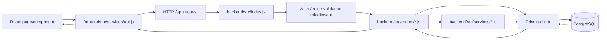

# Agent Navigation Map

This is the fast, human-readable companion to `Knowladge-Graph/knowledge-graph.json`.

## Request path



## Role flows

### Customer

`CustomerDashboard.jsx` -> `api.js` -> `/api/customer/*`, `/api/bookings`, `/api/services`, `/api/subscriptions`, `/api/profile`, `/api/support`, `/api/complaints`, `/api/notifications` -> customer routes/services -> `User`, `Booking`, subscription, support, complaint, notification models.

### Provider

`ProviderDashboard.jsx` -> `api.js` -> `/api/provider/availability`, `/api/provider/earnings`, `/api/provider/service-towns`, `/api/bookings/assigned`, `/api/bookings/:id/status`, `/api/bookings/:id/photos` -> provider/bookings/uploads routes -> `Provider`, `Booking`, `ServicePhoto`, `User` models.

Provider requests require a bearer token, `PROVIDER` role, and approved KYC where enforced by the route. Booking status transitions and PIN/photo checks are server-side rules.

### Admin

`AdminDashboard.jsx` -> `api.js` -> `/api/admin/*` -> admin route/middleware -> users, providers/KYC, bookings, plans, refunds, promotions, reports, and support models.

## Key files by responsibility

| Responsibility | File(s) |
|---|---|
| API base URL and bearer token | `frontend/src/services/api.js` |
| Protected client routes | `frontend/src/components/RequireAuth.jsx`, `frontend/src/services/roles.js`, `frontend/src/App.jsx` |
| Shared portal shell and UI effects | `frontend/src/components/PortalShell.jsx`, `PortalShell.css`, `PortalMotion.css`, `PortalSpatial.css`, `PortalPolish.css` |
| Provider UI | `frontend/src/pages/ProviderDashboard.jsx`, `ProviderDashboard.css`, `frontend/src/components/ProviderCalendar.jsx` |
| Route mounting and static frontend serving | `backend/src/index.js` |
| JWT and role gates | `backend/src/middleware/auth.js` |
| Database client | `backend/src/config/prisma.js` |
| Database contract | `backend/prisma/schema.prisma` |
| Local database | `docker-compose.yml` (`postgres:5432`) |

## Contract tracing checklist

Before changing a field or endpoint, search both directions:

```powershell
rg -n "endpoint-or-field" frontend/src backend/src backend/prisma
```

Then verify:

- request method/path and `VITE_API_URL` normalization;
- auth header, role, and KYC middleware;
- backend validation and error status codes;
- Prisma field names, enum casing, and relations;
- loading, error, empty, and success states in the UI;
- `npm run graph` output after the change.

