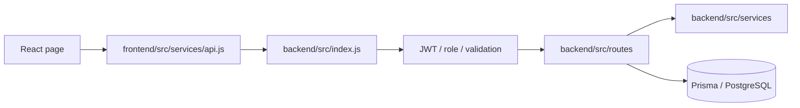

# Luxora Architecture Graph

The generated machine graph is `knowledge-graph.json`. Regenerate it after route, schema, service, or frontend API changes:

```powershell
npm run graph
```

## Request path



## Explorer controls & Architecture Explorer

The repository provides two synchronized, interactive visual explorers:

1. **Codebase Knowledge Graph (`index.html`)**:
   Deployed at [https://4raisan.github.io/Luxora_v1/](https://4raisan.github.io/Luxora_v1/). Visualizes granular AST-extracted code entities (React pages, API routes, middleware, domain services, Prisma models, and enums) with animated concentric force physics and blast-radius tracing.

2. **Live System Architecture Explorer (`architecture/index.html`)**:
   Deployed at [https://4raisan.github.io/Luxora_v1/architecture/](https://4raisan.github.io/Luxora_v1/architecture/). Provides a high-level, 12-view deterministic architectural blueprint spanning:
   - System Overview (5-tier full-stack hierarchy + DevOps & Deployment columns)
   - Frontend Presentation Layer
   - Backend API Gateway & Routers
   - Database Entity Architecture (Prisma Models & Relations)
   - Booking Lifecycle (End-to-end fulfillment flow)
   - Realtime / Server-Sent Events (SSE broadcasting hub)
   - Payments Engine (Tri-gateway settlement flow)
   - Email & External Cloud Integrations
   - CI/CD Quality Pipeline (8-check verification flow)
   - Production Deployment Topology (Vercel, Northflank, Neon, GitHub Pages)
   - Knowledge Graph Subsystem
   - Security & Cryptographic Architecture (Defense-in-depth)

Both explorers are deployed together to GitHub Pages by `.github/workflows/knowledge-graph-pages.yml`. Pull requests validate deterministic generation for both graphs (`npm run graph:verify`) without publishing; pushes to `main` publish the entire `Knowladge-Graph/` directory.

## Route groups

| Group | Mount | Main responsibility |
| --- | --- | --- |
| Auth | `/api/auth` | Login, registration, Google sign-in, password reset |
| Services | `/api` | Categories, services, subscriptions, entitlements |
| Bookings | `/api/bookings` | Booking, cancellation, provider status, PIN/photo lifecycle |
| Customer | `/api/customer` | Dashboard data |
| Provider | `/api/provider` | Availability, towns, earnings, bank accounts |
| Admin | `/api/admin` | Operations, plans, KYC, payouts, reports |
| Integrations | `/api` | PayHere, NOWPayments, demo payments, transactional email |

## Gates

| Action | Required checks |
| --- | --- |
| Customer booking | JWT, customer role, active entitlement, booking validation |
| Provider operations | JWT, provider role, approved KYC |
| Provider KYC upload | JWT and provider role only; pending KYC is allowed |
| Admin operations | JWT and admin role |
| PayHere webhook | Public endpoint with verified PayHere signature |
| NOWPayments IPN | Public endpoint with verified NOWPayments IPN HMAC-SHA512 signature |

## Product rules

- Roles: Customer, Provider, Admin. There is no Super Admin.
- Plans are admin-managed and always run for 30 days.
- Plan type is `Single Package` or `Combo Package`.
- Demo, PayHere, and NOWPayments are the supported payment flows.
- PayHere and NOWPayments checkouts require valid public HTTPS callback URLs.
- Entitlements and booking state are server-authoritative.

## Core models

| Model | Purpose |
| --- | --- |
| `User`, `Provider`, `KycDocument` | Accounts, provider KYC |
| `SubscriptionPlan`, `SubscriptionEntitlement`, `UserSubscription` | Packages and coins |
| `Booking`, `ServicePhoto` | Fulfilment, PINs, evidence |
| `Payment` | Payment state |
| `Notification`, `SupportTicket`, `Complaint` | Customer/admin communication |
| `ProviderBankAccount`, `ProviderPayout` | Monthly provider payout ledger |

For exact current endpoints and edges, use `knowledge-graph.json` or `index.html`.
