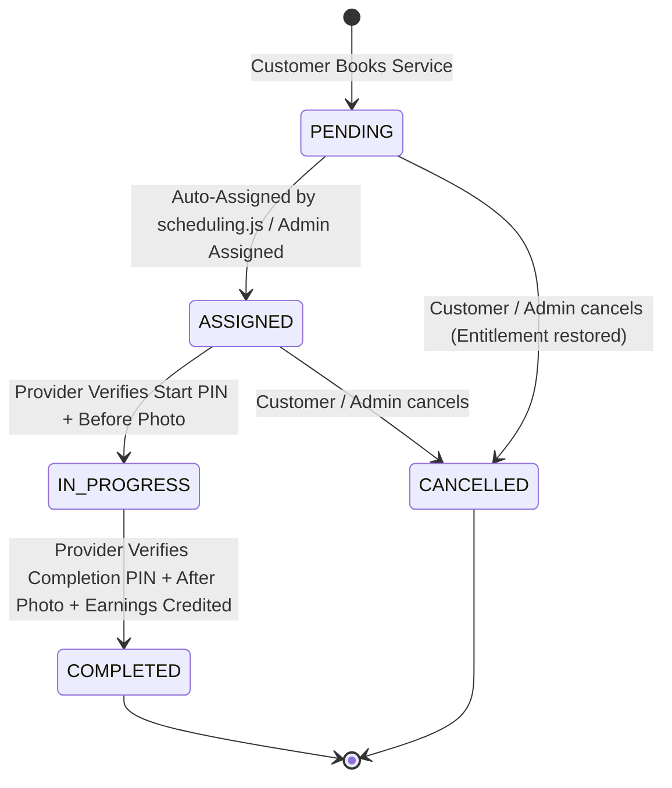
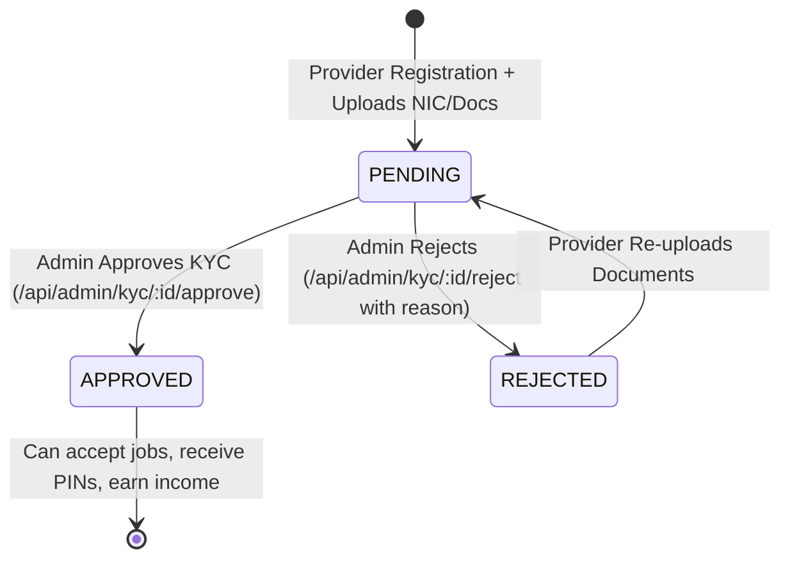
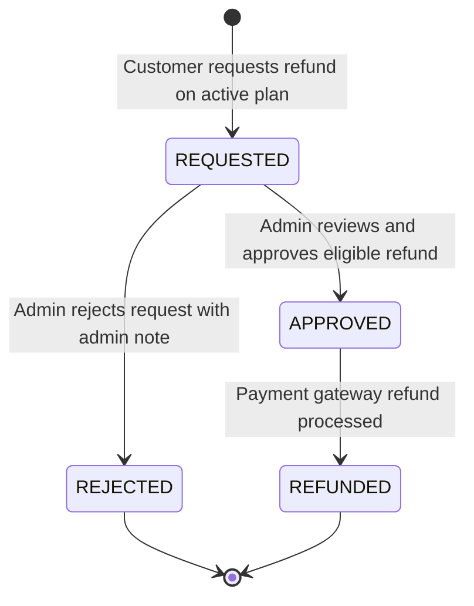

# Luxora System & Codebase Architecture Knowledge Graph

> **Confirmed product rules:** Read [CONFIRMED_PRODUCT_RULES.md](CONFIRMED_PRODUCT_RULES.md) before relying on older role, payment, booking, credit, or earnings notes in this document. There is no Super Admin role; Admin has full administrative authority.

> **Implementation audit:** The confirmed rules are not all complete in code. See the audit section in `CONFIRMED_PRODUCT_RULES.md` for the remaining Super Admin, PayPal residue, fixed-rate earnings, and monthly payout gaps.

This document serves as the **Single Source of Truth Knowledge Graph** mapping the entire Luxora platform. AI coding agents and human engineers can use this graph to understand end-to-end data flow, API route contracts, authorization gates, and database dependencies.

---

## 1. System Layer Topology

```mermaid
graph TD
    %% Client Layer
    subgraph UI ["Layer 1: Frontend UI (React + Vite :3000)"]
        Landing["Landing Pages (Navbar, Hero, Services, Plans, Footer)"]
        CustDash["CustomerDashboard.jsx (:3000/customer)"]
        ProvDash["ProviderDashboard.jsx (:3000/provider)"]
        AdminDash["AdminDashboard.jsx (:3000/admin)"]
        AuthPages["Login.jsx / Signup.jsx / ProviderRegister.jsx"]
        ApiClient["frontend/src/services/api.js (Axios/Fetch + JWT Header)"]
    end

    %% Network & Gateway Layer
    subgraph Gateway ["Layer 2: Network & Middleware (:5000/api)"]
        CORS["CORS Allow-List Handler (index.js)"]
        AuthMW["middleware/auth.js (JWT verify + Role Gate)"]
        RateLimitMW["middleware/rateLimit.js (Brute-force protection)"]
        ValMW["middleware/validators.js (Input Sanitation)"]
    end

    %% Route & Controller Layer
    subgraph Controllers ["Layer 3: Express Routes (backend/src/routes)"]
        R_Auth["routes/auth.js (/api/auth)"]
        R_Serv["routes/services.js (/api/categories, /api/services, /api/plans)"]
        R_Book["routes/bookings.js (/api/bookings)"]
        R_Cust["routes/customer.js (/api/customer)"]
        R_Prov["routes/provider.js (/api/provider)"]
        R_Admin["routes/admin.js (/api/admin)"]
        R_Ref["routes/refunds.js (/api/refunds)"]
        R_Integ["routes/integrations.js (/api/payhere, /api/paypal)"]
        R_Rev["routes/reviews.js (/api/reviews)"]
        R_Comp["routes/complaints.js (/api/complaints)"]
        R_Up["routes/uploads.js (/api/provider/kyc-documents, service photos)"]
        R_Supp["routes/support.js (/api/support)"]
        R_Notif["routes/notifications.js (/api/notifications)"]
    end

    %% Business Services Layer
    subgraph Services ["Layer 4: Business Logic Services (backend/src/services)"]
        S_Ent["services/entitlements.js (Plan unit balance calculation)"]
        S_Sched["services/scheduling.js (Town/Time auto-assignment engine)"]
        S_Pay["services/paymentContracts.js (PayHere/PayPal validation)"]
        S_Notif["services/notify.js (Push notification triggers)"]
    end

    %% Data Layer
    subgraph DB ["Layer 5: Database (Prisma ORM -> PostgreSQL)"]
        M_User[("User")]
        M_Prov[("Provider")]
        M_Kyc[("KycDocument")]
        M_Plan[("SubscriptionPlan")]
        M_Ent[("SubscriptionEntitlement")]
        M_USub[("UserSubscription")]
        M_Cat[("Category")]
        M_Serv[("Service")]
        M_Book[("Booking")]
        M_Photo[("ServicePhoto")]
        M_Pay[("Payment")]
        M_Ref[("RefundRequest")]
        M_Rev[("Review")]
        M_Comp[("Complaint")]
        M_Supp[("SupportTicket")]
        M_Notif[("Notification")]
        M_Promo[("Promotion")]
    end

    %% UI to API Client
    CustDash --> ApiClient
    ProvDash --> ApiClient
    AdminDash --> ApiClient
    AuthPages --> ApiClient

    %% API Client to Gateway
    ApiClient --> CORS
    CORS --> RateLimitMW
    RateLimitMW --> AuthMW
    AuthMW --> ValMW

    %% Gateway to Controllers
    ValMW --> R_Auth
    ValMW --> R_Serv
    ValMW --> R_Book
    ValMW --> R_Cust
    ValMW --> R_Prov
    ValMW --> R_Admin
    ValMW --> R_Ref
    ValMW --> R_Integ
    ValMW --> R_Rev
    ValMW --> R_Comp
    ValMW --> R_Up
    ValMW --> R_Supp
    ValMW --> R_Notif

    %% Controllers to Services
    R_Book --> S_Ent
    R_Book --> S_Sched
    R_Book --> S_Notif
    R_Integ --> S_Pay
    R_Ref --> S_Pay
    R_Admin --> S_Sched

    %% Services & Controllers to DB
    R_Auth --> M_User
    R_Prov --> M_Prov
    R_Up --> M_Kyc
    R_Serv --> M_Cat
    R_Serv --> M_Serv
    R_Serv --> M_Plan
    S_Ent --> M_USub
    S_Ent --> M_Ent
    R_Book --> M_Book
    R_Book --> M_Photo
    S_Pay --> M_Pay
    R_Ref --> M_Ref
    R_Rev --> M_Rev
    R_Comp --> M_Comp
    R_Supp --> M_Supp
    R_Notif --> M_Notif
    R_Admin --> M_Promo
```

---

## 2. API Endpoints & Role Authorization Matrix

| Endpoint | Method | Role Allowed | Middleware Chain | DB Models Queried/Updated |
| :--- | :--- | :--- | :--- | :--- |
| `/api/auth/login` | `POST` | Public | `rateLimit` | `User` |
| `/api/auth/register` | `POST` | Public | `rateLimit`, `validateUser` | `User`, `Provider` |
| `/api/categories` | `GET` | Public | None | `Category`, `Service` |
| `/api/plans` | `GET` | Public | None | `SubscriptionPlan`, `SubscriptionEntitlement` |
| `/api/customer/subscriptions` | `GET` | `CUSTOMER` | `authenticateToken`, `requireRole(['CUSTOMER'])` | `UserSubscription`, `SubscriptionPlan` |
| `/api/customer/entitlements` | `GET` | `CUSTOMER` | `authenticateToken`, `requireRole(['CUSTOMER'])` | `UserSubscription`, `SubscriptionEntitlement` |
| `/api/bookings` | `POST` | `CUSTOMER` | `authenticateToken`, `requireRole(['CUSTOMER'])` | `Booking`, `UserSubscription`, `Provider` |
| `/api/bookings/:id/cancel` | `POST` | `CUSTOMER` / `ADMIN` | `authenticateToken` | `Booking`, `UserSubscription` |
| `/api/provider/me` | `GET` | `PROVIDER` | `authenticateToken`, `requireRole(['PROVIDER'])` | `Provider`, `KycDocument` |
| `/api/provider/kyc-documents` | `POST` | `PROVIDER` (Pending KYC) | `authenticateToken` | `KycDocument`, `Provider` |
| `/api/provider/jobs` | `GET` | `PROVIDER` (Approved) | `authenticateToken`, `requireKycApproved` | `Booking`, `Service`, `User` |
| `/api/bookings/:id/start-pin` | `POST` | `PROVIDER` | `authenticateToken`, `requireKycApproved` | `Booking` |
| `/api/bookings/:id/complete-pin` | `POST` | `PROVIDER` | `authenticateToken`, `requireKycApproved` | `Booking`, `Provider` (Earnings) |
| `/api/admin/users` | `GET` | `ADMIN` | `authenticateToken`, `requireRole(['ADMIN'])` | `User`, `Provider` |
| `/api/admin/kyc/:id/approve` | `POST` | `ADMIN` | `authenticateToken`, `requireRole(['ADMIN'])` | `Provider`, `Notification` |
| `/api/admin/kyc/:id/reject` | `POST` | `ADMIN` | `authenticateToken`, `requireRole(['ADMIN'])` | `Provider`, `Notification` |
| `/api/admin/plans` | `POST/PUT` | `SUPERADMIN` | `authenticateToken`, `requireSuperAdmin` | `SubscriptionPlan`, `SubscriptionEntitlement` |
| `/api/refunds/request` | `POST` | `CUSTOMER` | `authenticateToken`, `requireRole(['CUSTOMER'])` | `RefundRequest`, `UserSubscription` |
| `/api/refunds/:id/review` | `POST` | `ADMIN` | `authenticateToken`, `requireRole(['ADMIN'])` | `RefundRequest`, `UserSubscription`, `Payment` |
| `/api/payhere/webhook` | `POST` | Public (Signature Verified) | `verifyPayHereSig` | `Payment`, `UserSubscription`, `Booking` |

---

## 3. Entity State Machine Lifecycles

### 3.1 Booking Lifecycle (`BookingStatus`)

### 3.2 Provider KYC Lifecycle (`KycStatus`)

### 3.3 Refund Request Lifecycle (`RefundStatus`)

---

## 4. Key Cross-Cutting Invariants (Rulebook)

1. **Entitlement Protection**: A booking created under a subscription must deduct units matching the service category. If cancelled prior to `IN_PROGRESS`, the entitlement units are refunded back to `UserSubscription`.
2. **Provider Job Gate**: Providers with `kycStatus !== 'APPROVED'` cannot access `/api/provider/jobs` or verify booking PINs.
3. **PIN Integrity**: Start PIN and Completion PIN hashes are compared using crypto HMAC/Bcrypt; brute-force attempts lock the booking for 15 minutes after 3 failures (`pinAttempts >= 3`).
4. **SuperAdmin Privilege**: Only users with `isSuperAdmin: true` can modify `PlatformSetting` and create or edit `SubscriptionPlan` definitions.
