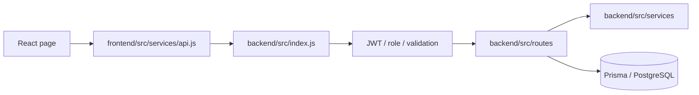

# Luxora Architecture Graph

The generated machine graph is `knowledge-graph.json`. Regenerate it after route, schema, service, or frontend API changes:

```powershell
npm run graph
```

## Request path



## Explorer controls

Open `index.html` to explore the graph. The sidebar inspector is collapsible and its recovery button remains visible. The settings dock keeps the default animated force layout and adds controls for physics motion, edge labels, node scale, edge strength, connected spacing, outer pull, fit, and reset. Search and the layer filters work together, so both can narrow the visible graph.

## Route groups

| Group | Mount | Main responsibility |
| --- | --- | --- |
| Auth | `/api/auth` | Login, registration, Google sign-in, WhatsApp registration proof |
| Services | `/api` | Categories, services, subscriptions, entitlements |
| Bookings | `/api/bookings` | Booking, cancellation, provider status, PIN/photo lifecycle |
| Customer | `/api/customer` | Dashboard data |
| Provider | `/api/provider` | Availability, towns, earnings, bank accounts |
| Admin | `/api/admin` | Operations, plans, KYC, payouts, reports |
| Integrations | `/api` | PayHere, demo payments, email, WhatsApp verification |

## Gates

| Action | Required checks |
| --- | --- |
| Customer booking | JWT, customer role, active entitlement, booking validation |
| Provider operations | JWT, provider role, approved KYC, verified WhatsApp number |
| Provider KYC upload | JWT and provider role only; pending KYC is allowed |
| Admin operations | JWT and admin role |
| PayHere webhook | Public endpoint with verified PayHere signature |

## Product rules

- Roles: Customer, Provider, Admin. There is no Super Admin.
- Plans are admin-managed and always run for 30 days.
- Plan type is `Single Package` or `Combo Package`.
- Demo and PayHere are the only payment flows.
- PayHere checkout requires valid public HTTPS callback URLs.
- Entitlements and booking state are server-authoritative.
- A provider who changes phone must verify the new WhatsApp number before operating.

## Core models

| Model | Purpose |
| --- | --- |
| `User`, `Provider`, `KycDocument` | Accounts, provider KYC, WhatsApp verification state |
| `SubscriptionPlan`, `SubscriptionEntitlement`, `UserSubscription` | Packages and coins |
| `Booking`, `ServicePhoto` | Fulfilment, PINs, evidence |
| `Payment`, `RefundRequest` | Payment and refund state |
| `Notification`, `SupportTicket`, `Complaint` | Customer/admin communication |
| `ProviderBankAccount`, `ProviderPayout` | Monthly provider payout ledger |

For exact current endpoints and edges, use `knowledge-graph.json` or `index.html`.
