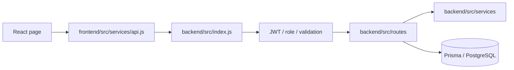

# Luxora Architecture Graph

The generated machine graph is `knowledge-graph.json`. Regenerate it after route, schema, service, or frontend API changes:

```powershell
npm run graph
```

## Request path



## Explorer controls

Open `index.html` to explore the graph. The sidebar inspector is collapsible and its recovery button remains visible. The settings dock keeps the default animated force layout and adds controls for physics motion, edge labels, node scale, edge strength, connected spacing, outer pull, fit, and reset. Search and the layer filters work together, so both can narrow the visible graph.

The explorer is deployed separately by `.github/workflows/knowledge-graph-pages.yml`. Once GitHub Pages is enabled and a deployment succeeds, its project-site URL will be `https://4raisan.github.io/Luxora_v1/`. Pushes to `main` and manual workflow dispatches regenerate the source-derived JSON, validate it, verify deterministic output, and publish only this directory. The explorer fetches `./knowledge-graph.json`, so it works under the repository path used by GitHub Pages.

## Route groups

| Group | Mount | Main responsibility |
| --- | --- | --- |
| Auth | `/api/auth` | Login, registration, Google sign-in, password reset |
| Services | `/api` | Categories, services, subscriptions, entitlements |
| Bookings | `/api/bookings` | Booking, cancellation, provider status, PIN/photo lifecycle |
| Customer | `/api/customer` | Dashboard data |
| Provider | `/api/provider` | Availability, towns, earnings, bank accounts |
| Admin | `/api/admin` | Operations, plans, KYC, payouts, reports |
| Integrations | `/api` | PayHere, NOWPayments, demo payments, transactional email |

## Gates

| Action | Required checks |
| --- | --- |
| Customer booking | JWT, customer role, active entitlement, booking validation |
| Provider operations | JWT, provider role, approved KYC |
| Provider KYC upload | JWT and provider role only; pending KYC is allowed |
| Admin operations | JWT and admin role |
| PayHere webhook | Public endpoint with verified PayHere signature |
| NOWPayments IPN | Public endpoint with verified NOWPayments IPN HMAC-SHA512 signature |

## Product rules

- Roles: Customer, Provider, Admin. There is no Super Admin.
- Plans are admin-managed and always run for 30 days.
- Plan type is `Single Package` or `Combo Package`.
- Demo, PayHere, and NOWPayments are the supported payment flows.
- PayHere and NOWPayments checkouts require valid public HTTPS callback URLs.
- Entitlements and booking state are server-authoritative.

## Core models

| Model | Purpose |
| --- | --- |
| `User`, `Provider`, `KycDocument` | Accounts, provider KYC |
| `SubscriptionPlan`, `SubscriptionEntitlement`, `UserSubscription` | Packages and coins |
| `Booking`, `ServicePhoto` | Fulfilment, PINs, evidence |
| `Payment`, `RefundRequest` | Payment and refund state |
| `Notification`, `SupportTicket`, `Complaint` | Customer/admin communication |
| `ProviderBankAccount`, `ProviderPayout` | Monthly provider payout ledger |

For exact current endpoints and edges, use `knowledge-graph.json` or `index.html`.
