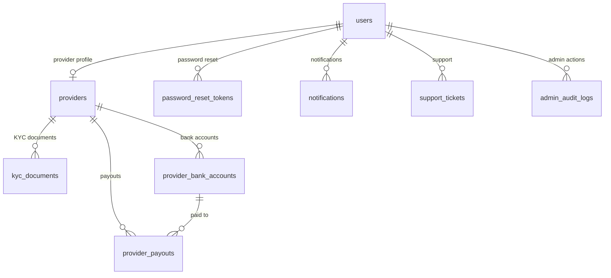
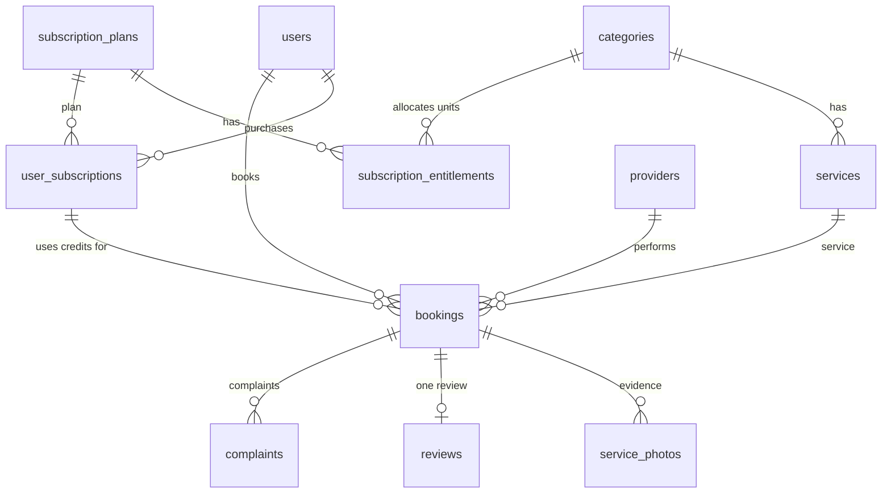
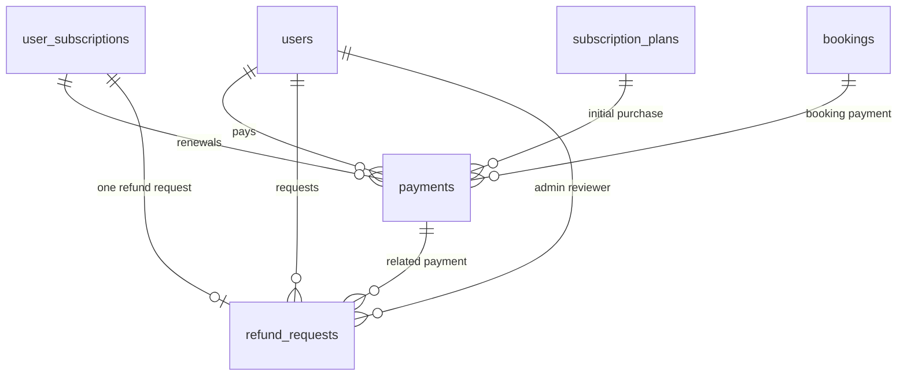

# Luxora Database ER Diagram

This is the entity-relationship reference for Luxora. It is generated from the intended Prisma data model in `backend/prisma/schema.prisma` and uses the physical PostgreSQL table names.

The SVG below is the primary diagram and displays in standard Markdown viewers without requiring Mermaid support.



## Scope and notation

- `||--o{` means **one-to-many**.
- `||--o|` means **one-to-zero-or-one**.
- `||--||` means **one-to-one**.
- Fields marked `FK` are foreign keys. `PK` is the primary key and `UK` is unique.
- Most primary keys are auto-incrementing integers.

## Mermaid source (optional)

The following is a machine-readable Mermaid version of the same structure for tools that support Mermaid rendering.

```mermaid
erDiagram
    users ||--o| providers : "has provider profile"
    users ||--o{ password_reset_tokens : "requests"
    users ||--o{ user_subscriptions : "owns"
    users ||--o{ bookings : "creates"
    users ||--o{ payments : "makes"
    users ||--o{ refund_requests : "requests"
    users ||--o{ refund_requests : "reviews"
    users ||--o{ reviews : "writes"
    users ||--o{ complaints : "raises"
    users ||--o{ notifications : "receives"
    users ||--o{ support_tickets : "opens"
    users ||--o{ admin_audit_logs : "records"

    providers ||--o{ kyc_documents : "submits"
    providers ||--o{ bookings : "is assigned"
    providers ||--o{ reviews : "receives"
    providers ||--o{ provider_bank_accounts : "owns"
    providers ||--o{ provider_payouts : "earns"
    provider_bank_accounts ||--o{ provider_payouts : "receives"

    categories ||--o{ services : "contains"
    categories ||--o{ subscription_entitlements : "included in"
    subscription_plans ||--o{ subscription_entitlements : "defines"
    subscription_plans ||--o{ promotion_plans : "discount eligibility"
    promotions ||--o{ promotion_plans : "targets packages"
    subscription_plans ||--o{ user_subscriptions : "selected by"
    subscription_plans ||--o{ payments : "paid through"

    user_subscriptions ||--o{ bookings : "funds"
    user_subscriptions ||--o| refund_requests : "may have"
    user_subscriptions ||--o{ payments : "renewed through"

    services ||--o{ bookings : "is booked"
    bookings ||--o{ service_photos : "has"
    bookings ||--o{ payments : "is paid by"
    bookings ||--o| reviews : "has"
    bookings ||--o{ complaints : "may receive"

    payments ||--o{ refund_requests : "supports"
    promotions ||--o{ payments : "applied to"

    users {
        int id PK
        string email UK
        string role
        boolean active
        int tokenVersion
    }
    providers {
        int id PK
        int userId FK_UK
        string kycStatus
        string category
        decimal earnings
    }
    kyc_documents {
        int id PK
        int providerId FK
        string documentType
        string filePath
    }
    password_reset_tokens {
        int id PK
        int userId FK
        string tokenHash UK
        datetime expiresAt
    }
    categories {
        int id PK
        string name UK
        string description
    }
    services {
        int id PK
        int categoryId FK
        string title
        decimal price
        decimal providerEarning
    }
    subscription_plans {
        int id PK
        string title
        string type
        decimal priceMonthly
        int displayOrder
    }
    subscription_entitlements {
        int id PK
        int planId FK
        int categoryId FK
        int units
    }
    user_subscriptions {
        int id PK
        int userId FK
        int planId FK
        string status
        datetime endDate
    }
    bookings {
        int id PK
        int userId FK
        int providerId FK
        int serviceId FK
        int subscriptionId FK
        string status
        decimal totalPrice
    }
    service_photos {
        int id PK
        int bookingId FK
        string kind
        string filePath
    }
    payments {
        int id PK
        int userId FK
        int planId FK
        int bookingId FK
        int subscriptionId FK
        string gatewayOrderId UK
        string status
        decimal expectedAmount
    }
    refund_requests {
        int id PK
        int userId FK
        int subscriptionId FK_UK
        int paymentId FK
        int reviewedById FK
        string status
    }
    reviews {
        int id PK
        int bookingId FK_UK
        int userId FK
        int providerId FK
        int rating
    }
    complaints {
        int id PK
        int userId FK
        int bookingId FK
        string status
    }
    notifications {
        int id PK
        int userId FK
        boolean read
    }
    support_tickets {
        int id PK
        int userId FK
        string status
        string priority
    }
    provider_bank_accounts {
        int id PK
        int providerId FK
        boolean selected
    }
    provider_payouts {
        int id PK
        int providerId FK
        int bankAccountId FK
        string period
        decimal amount
        string status
    }
    admin_audit_logs {
        int id PK
        int adminId FK
        string action
        string targetType
        string targetId
    }
    platform_settings {
        int id PK
        string paymentMode
    }
    promotions {
        int id PK
        string code UK
        decimal discountPct
        boolean active
    }
    promotion_plans {
        int promotionId FK
        int planId FK
    }
```

## Domain breakdown

### Identity and provider operations



### Services, packages, and bookings



### Payments and refunds



## Table reference

| Table | Purpose | Key relationships |
| --- | --- | --- |
| `users` | Customer, provider, and admin identity | Parent for most user-owned records; one optional provider profile |
| `password_reset_tokens` | Secure password reset requests | Belongs to `users` |
| `providers` | Provider profile, KYC state, availability, earnings | Belongs to one `users` row |
| `kyc_documents` | Provider KYC upload metadata | Belongs to `providers` |
| `categories` | Service categories, such as Auto Care or Garden Care | Parent of services and plan entitlements |
| `services` | Bookable service definitions and pricing | Belongs to `categories` |
| `subscription_plans` | Package/catalogue plan definition | Parent of entitlements, subscriptions, and plan payments |
| `subscription_entitlements` | Category-specific service units included in a plan | Bridge between plans and categories; unique per plan/category |
| `user_subscriptions` | A user’s purchased plan and membership status | Belongs to a user and a plan |
| `bookings` | Scheduled service work | Belongs to user and service; optionally provider and subscription |
| `service_photos` | Before/after evidence for a booking | Belongs to `bookings` |
| `payments` | Payment intent, gateway response, and captured amount | Belongs to user; may reference plan, booking, or subscription |
| `refund_requests` | Refund workflow for a subscription | One per subscription; may reference payment and reviewing admin |
| `reviews` | Customer review of a completed booking/provider | One per booking; references user and provider |
| `complaints` | Customer complaint workflow | Belongs to user; may relate to a booking |
| `support_tickets` | Customer support conversation and status | Belongs to user |
| `notifications` | In-app customer/provider/admin messages | Belongs to user |
| `provider_bank_accounts` | Provider payout destination | Belongs to provider |
| `provider_payouts` | Monthly/provider settlement record | Belongs to provider and bank account |
| `admin_audit_logs` | Traceable administrative actions | Belongs to the admin `users` row |
| `platform_settings` | Singleton platform configuration | Standalone configuration record |
| `promotions` | Promotion codes, discount window, and campaign settings | Parent of targeted package assignments and applied payments |
| `promotion_plans` | Package-specific promotion eligibility | Bridge between `promotions` and `subscription_plans`; no rows means a catalogue-wide promotion |

## Relationship and deletion rules

| Parent | Child | Database behaviour |
| --- | --- | --- |
| `users` | `providers`, password reset tokens, subscriptions, payments, support tickets, notifications, audit logs | Cascade delete where defined |
| `providers` | KYC documents, bank accounts, payouts | Documents/accounts cascade; payout relationship is retained through provider reference rules |
| `categories` | `services`, subscription entitlements | Cascade delete |
| `subscription_plans` | Entitlements | Cascade delete |
| `subscription_plans` | Payments | Restrict delete; preserve payment history |
| `subscription_plans` | Promotion package assignments | Cascade delete |
| `promotions` | Promotion package assignments | Cascade delete |
| `promotions` | Payments | Set null on promotion deletion; preserve the recorded paid amount |
| `user_subscriptions` | Refund request | Restrict delete; preserve refund records |
| `bookings` | Service photos | Cascade delete |
| `payments` | Booking/subscription/refund request links | Booking/subscription/refund link may be set to null to preserve payment records |

## Important constraints

- `users.email`, `password_reset_tokens.tokenHash`, `payments.gatewayOrderId`, and `payments.idempotencyKey` are unique.
- A provider profile is unique per user (`providers.userId`).
- A plan can have only one entitlement per category (`subscription_entitlements.planId + categoryId`).
- A booking has at most one review (`reviews.bookingId`).
- A subscription has at most one refund request (`refund_requests.subscriptionId`).
- A provider can have at most one payout for a given period (`provider_payouts.providerId + period`).

## Current database alignment note

The live database currently includes the legacy `phone_otp_challenges` table. It is not present in the current Prisma schema. Conversely, the schema defines `admin_audit_logs`, but that table was not present in the live database when this document was created.

Before depending on audit logging in production, reconcile the migrations and re-check the live database table list.

## Maintenance

When a Prisma model, relation, enum, or migration changes:

1. Update `backend/prisma/schema.prisma` and the relevant migration.
2. Apply the migration to the target environment.
3. Update this diagram and table reference in the same change.
4. Verify with `npx prisma migrate status --schema backend/prisma/schema.prisma` and a read-only database table check.
