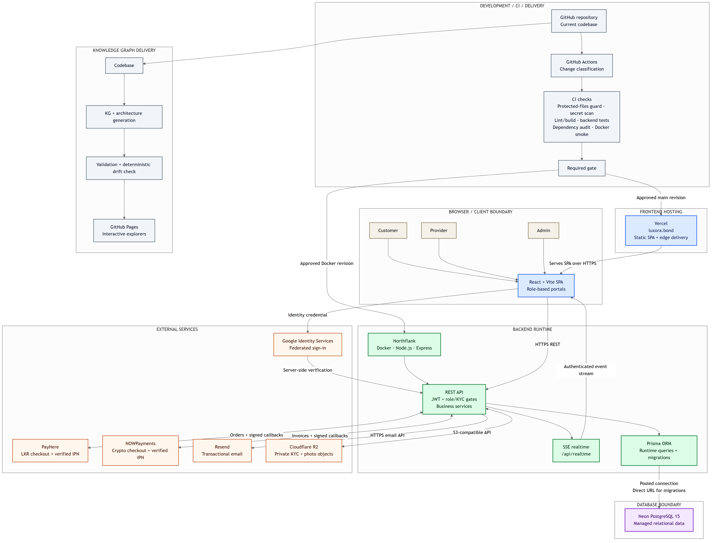

# Luxora High-Level Architecture

This diagram is the presentation view of Luxora's current production, delivery, and knowledge-graph architecture. Its editable Mermaid source is [`luxora-high-level-architecture.mmd`](luxora-high-level-architecture.mmd).

## Scope

- Customers, providers, and admins use the React/Vite application hosted by Vercel.
- The browser calls the Dockerized Node.js/Express backend hosted by Northflank and receives authenticated realtime updates through Server-Sent Events.
- Prisma connects the backend to Neon PostgreSQL for runtime queries and migrations.
- Current external services are PayHere, NOWPayments, Resend, Cloudflare R2, and Google Identity Services.
- GitHub Actions classifies changes and runs the applicable protected-file, security, quality, test, audit, Docker, and required-gate checks before delivery.
- The codebase also feeds deterministic knowledge-graph generation and validation before the interactive explorers are published to GitHub Pages.

Redis is deferred and is not shown as a production component.
